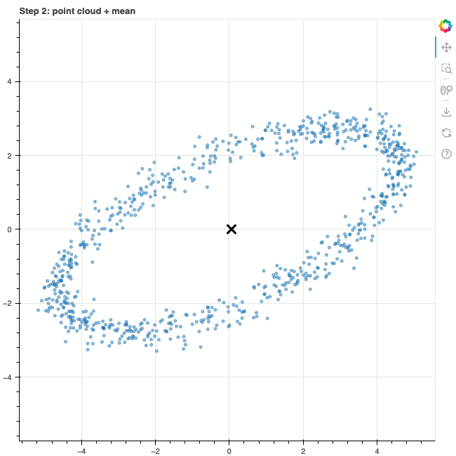
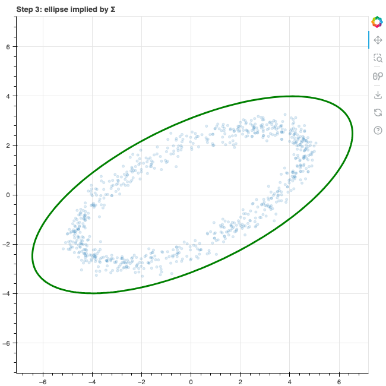
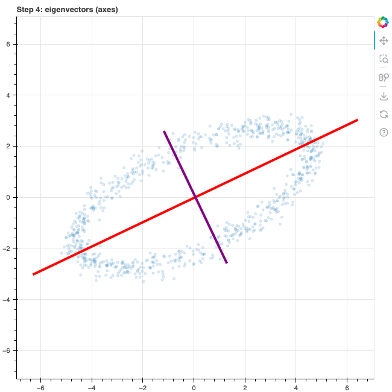
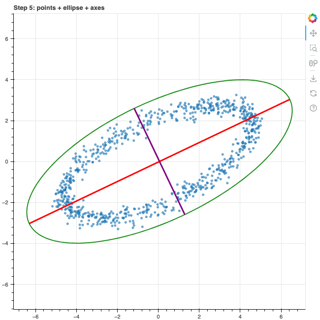

# Simple idea

## What we are checking (concepts)

We generate 2D points that lie on a rotated ellipse (plus small noise) and verify:

- how a point cloud becomes a **covariance matrix**
- how **eigenvectors of the covariance matrix** describe the dominant directions (axes) of that cloud
- how **eigenvalues** quantify variance along those axes

In other words: covariance captures a linear summary of the cloud shape, and eigendecomposition turns it into “principal axes”.

## Data: ellipse → point cloud

Parametric ellipse (before rotation) in R^2:

```text
[x(t), y(t)]^T = [a cos t, b sin t]^T,    t ~ Unif(0, 2π)
```

Rotation by angle θ:

```text
R(θ) = [[cosθ, -sinθ],
        [sinθ,  cosθ]]

p(t) = R(θ) [a cos t, b sin t]^T + ε
```

where ε is small isotropic noise.

## Point cloud → covariance matrix

Let the dataset be {x_i}_{i=1..n}, where each x_i is a 2D vector.
First compute the mean:

```text
μ = (1/n) * Σ_{i=1..n} x_i
```

Center the data:

```text
z_i = x_i - μ
```

Stack centered points into a matrix Z in R^{2×n} (each column is z_i).
Then the sample covariance matrix is:

```text
Σ = (1/(n-1)) * Z * Z^T
  = [[Var(x),   Cov(x,y)],
     [Cov(x,y), Var(y)]]
```

## Covariance → eigenvectors (principal directions)

We compute the eigendecomposition:

```text
Σ v_k = λ_k v_k,   k in {1, 2}
```

For a real symmetric Σ, eigenvectors are orthonormal and eigenvalues are real.
Sorted λ1 >= λ2 >= 0:

- v1 is the direction with **maximum variance**
- v2 is orthogonal to v1 and has the **remaining variance**

## Why eigenvectors align with the ellipse axes

Any unit direction u has projected variance:

```text
Var(u^T x) = u^T Σ u
```

Maximizing u^T Σ u under ||u||=1 yields u=v1 (Rayleigh quotient), and the maximum value is λ1.
So the eigenvectors give the directions of maximal/minimal spread of the cloud — visually the ellipse’s axes.

In the notebook we also draw an ellipse implied by \(\Sigma\):

```text
Ellipse(Σ):  μ + V diag(sqrt(λ1), sqrt(λ2)) s,
where s = [cos t, sin t]^T, t in [0, 2π)
and V = [v1 v2]
```

This ellipse shares the same axes directions v1, v2.

## Step-by-step Bokeh visualizations

GitHub README cannot render Bokeh interactively. Instead, we generate PNGs from Bokeh and commit them into `assets/`.

### Setup

```bash
python3 -m pip install numpy bokeh
```

To generate images, run the last cell in `eigen_vectors_vis.ipynb`. It will try to export PNGs into `assets/`.

### Step 1 — raw point cloud


### Step 2 — show the mean (center)



### Step 3 — covariance ellipse (from Σ)



### Step 4 — eigenvectors as principal axes



### Step 5 — final combined view (points + ellipse + axes)



If PNG export fails in your environment, install export dependencies:

```bash
python3 -m pip install selenium webdriver-manager pillow
```